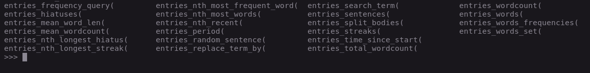

# Semasia - utilities for analyzing a list of journal entries

If you want to use this, take a look at the code at [the examples notebook](https://github.com/sarmentow/semasia/blob/master/src/examples.ipynb)

## Using NLP to see what emotions I felt while I was journalling 

While writing one day, I realized that by being consistent with my writing a lot of data was being created that could be play around with. At first I just wanted some basic information about the words that were being used and the length of my journal entries, so I wrote a small script with lots of utility functions to process my text files.

Above is a snippet of what what could be accomplished with these utility functions. Things like searching for the amount of times a certain query appeared throughout all documents, listing all periods in which daily writing was sustained, listing all periods that were spent without writing, the total amount of words written so far... The list goes on. 

It was pretty fun to get some info on everything I had written.

After doing all that I started thinking about what other information could be extracted from my journal entries. Was it possible that to draw some sort of relation between the emotions behind what I was writing and certain important events in my life that ocurred in the same period? It was interesting to think about what could be seen if there was a way of plotting emotions over time. Perhaps I would be able to relate the things that happened in my life with the emotions in my writing and check how my thoughts and ideas were affected by these events. 

I already had some knowledge of machine learning, so there was already a rough sketch of what would be needed to accomplish my objective. At first I thought that traning my own language model would be needed in order to be able to calculate the emotions in a text, so after searching around for datasets that correlated text to emotions, I found [GoEmotions](https://arxiv.org/abs/2005.00547), which contains lots of reddit comments which were labeled by assigning 1's (which means yes) and 0's (which means no) to a list of 27 emotions + a neutral category.

I had no idea how long it would take to code and train a model such as this and ended up deciding to use a pre-trained model on the GoEmotions dataset instead of training my own. So I found a model on HuggingFace and right away I was able to write a sentence in a little input box and get back some data about the emotions in the written text. Progress boyz.

So the next step was setting up a way of giving a journal entry and getting back a list of emotions. 

I knew that there would be some sort of limit as to how much text I was able to send at once for the language model to make its predictions given how bad language models are at keeping up with long texts containing lots of contextual relationships. 

What I came up with was breaking an entry up into individual sentences and then calculating the mean of all emotions in an entry. There are probably smarter and more accurate ways of solving this problem, but this was simple and easy to write.

Also, it was highly desirable to run the language model locally for privacy reasons - and also in order to avoid rate limiting for sending too many requests (one for each sentence in each of my entries). It wasn't fast in my computer, but at least I was able to run predictions as many times as I wanted.

After creating some more utility functions in order to return readable results (just like the HuggingFace API would), I was finally able to piece together a complete program that was able to tell me what emotions I felt while I was writing. 

There was still a lot of work to be done, like filtering out all journal entries which weren't 100% written in english in order to avoid the model spitting nonsense about the emotions in portuguese text (given it was trained on english text), write a python notebook to cobble together everything necessary from my utility functions and the language model in order to be able to plot my emotions over time, and then, voila.

So how good were the predictions above? Kind of. For individual sentences I've found that the language model does a good enough job of telling what emotions are involved. Also, the guy who trained the model I'm using [actually wrote](https://huggingface.co/joeddav/distilbert-base-uncased-go-emotions-student) that the performance of the model isn't as good as models trained with full supervision. I went with his model anyway because I felt like it was good enough. Despite that being the case, the data looks a bit messy when visualized.

I think a big problem that contributes to how chaotic the data looks has to do with my filtering of the entries that weren't written in english. 

See, I used to write constantly in english but at some point I found that sometimes writing in portuguese made accurately depicting and describing my thoughts and feelings easier (though at times I switch back to english when I want to be more objective and concise). This frequent switch between languages made the available english entries for classifying emotions be in discontinuous periods that were usually distant from one another, making it look like there's no continuity, just random spikes of feelings between different entries.

I believe that if the data was more continuous, the score for each feeling would look less random and more in line with what one would expect of data points that are close to one another.

Also, there's way too much going on at once in the graph above, sometimes it's even hard to tell the difference between colors. 

In order to see whether I was right about why it looks so chaotic, by using some of the utility functions that were written before, I found a period of 9 daily  english entries. Not only that, each emotion was plotted separetely. Here's a sample:

That's better. Because the graphs are not to scale (you can see that the values on the y axis for love are very small while the ones for realization are much larger) it's easy to misrepresent the emotions that were actually felt. I've noticed that when an emotional statement is processed by the language model, it increases its scores in pretty much all emotions, though the emotions that were actually present in the text do get a bigger increase than the other ones.

This was fun, and has a lot of potential. I didn't want to get distracted by stuff that had nothing to do with the initial aim of this project - to get info about the data I created on my journal - so I didn't create a GUI or anything like that. It's all a couple of scripts and a notebook with not so great code that spits out these graphs.
